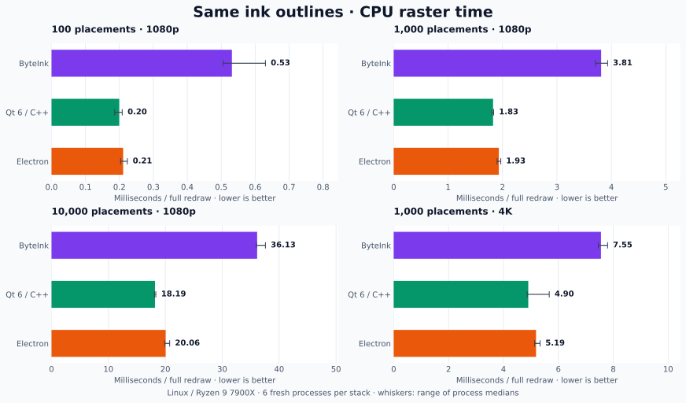
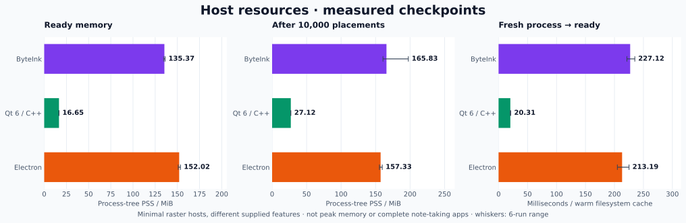
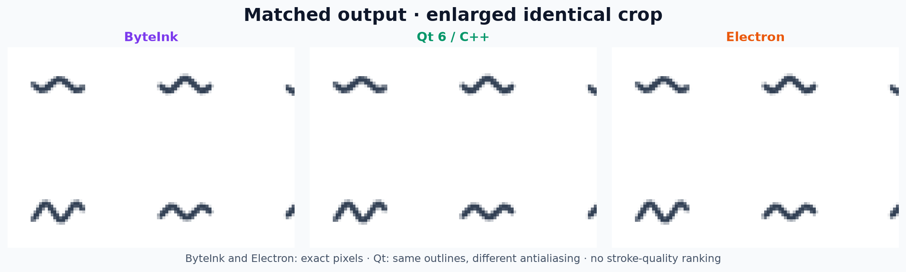

# ByteInk vs Qt 6 and Electron

ByteInk supplies an editable ink stack. Qt and Electron supply general UI and
drawing primitives. This comparison measures a shared CPU raster workload and
identifies the ink features each framework leaves to the application.

## Features supplied

**App** means application code or another library is needed for the ink workflow;
it does not mean the framework cannot implement it.

| Capability | ByteInk | Qt 6 / C++ | Electron |
| --- | --- | --- | --- |
| Pen pressure, tilt, eraser input | Native Windows, X11/XWayland and JBR Wayland adapters | Tablet/pointer events | Browser Pointer Events; backend dependent |
| Modeled handwriting and brush behaviors | Pinned AndroidX/Google Ink | App / ink library | App / ink library |
| Replaceable predicted tails; real-only finished strokes | `InkAuthoringSession` | App | App; browser predictions may be available |
| Editable stroke meshes and outlines | Owned geometry snapshots | Path/mesh primitives; ink model is App | Path/WebGL primitives; ink model is App |
| Partial erasing with saved operation replay | Mask, subtraction and replay APIs | Path booleans; ink history is App | Compositing; ink history is App |
| Lasso, hit testing, move and resize | Ink-aware helpers | Geometry primitives; ink selection is App | Geometry primitives; ink selection is App |
| ViveNotes Android stroke/operation interoperability | Tested codecs and unknown-data preservation | App | App |
| Textures, brush vertex effects, animated stamps | `InkMeshRenderer` | Shader primitives; brush engine is App | Canvas/WebGL primitives; brush engine is App |
| Bounded ink caches and software stage diagnostics | Supplied renderer/authoring APIs | App instrumentation and cache policy | App instrumentation and cache policy |
| Application UI and rich text | Host application / Compose | Qt Widgets / Quick | HTML / DOM |
| Handwriting recognition and cloud sync | App | App | App |

ByteInk's advantage is the **packaged ink workflow and Android compatibility**.
Pressure and vector drawing are shared capabilities. Qt/Electron can integrate
an ink engine too. See ByteInk's [authoring](authoring.md),
[rendering](rendering.md), [editing](operations.md) and [storage](storage.md) APIs;
[Qt tablet events](https://doc.qt.io/qt-6/qtabletevent.html),
[Qt paths](https://doc.qt.io/qt-6/qpainterpath.html) and
[browser pen/prediction events](https://www.w3.org/TR/pointerevents3/) document the
framework primitives.

## Measured results

Measured **2026-10-09**, Linux x86_64 · Ryzen 9 7900X · 30.48 GiB usable RAM ·
`powersave` CPU governor · Qt **6.11.2** · Electron **44.7.0** ·
ByteInk **0.1.0-SNAPSHOT**, AndroidX Ink **1.1.0-alpha06**, Compose **1.12.1**,
Skiko **0.150.1**, JBR **25.0.4.1**. Exact versions and source/binary hashes are in
the [run manifest](../assets/toolkit-comparison/evidence/manifest.json).

Qt has the lowest opaque-redraw medians and host memory here. Electron has the
lowest medians for blank and translucent cases. ByteInk's packaged ink features
come with higher CPU redraw costs in this configuration.

<!-- toolkit-results:start -->

| CPU raster workload | ByteInk | Qt 6 / C++ | Electron |
| --- | ---: | ---: | ---: |
| Blank · 1080p | 0.198 (0.207) | 0.072 (0.080) | 0.063 (0.073) |
| 100 placements · 1080p | 0.531 (0.579) | 0.200 (0.216) | 0.211 (0.263) |
| 1,000 placements · 1080p | 3.812 (3.898) | 1.826 (1.879) | 1.932 (2.103) |
| 10,000 placements · 1080p | 36.134 (37.494) | 18.185 (18.506) | 20.056 (20.453) |
| 1,000 placements · 4K | 7.553 (8.002) | 4.904 (5.230) | 5.187 (5.503) |
| 1,000 translucent · 1080p | 4.299 (4.558) | 2.561 (2.761) | 1.925 (2.085) |
| 1,000 at 2× zoom · 1080p | 6.823 (6.979) | 4.322 (4.457) | 4.579 (4.803) |

Times are **median (P95), milliseconds; lower is better**. Each entry is the
median of six process statistics, with 30 measured frames per process.

| Host checkpoint | ByteInk | Qt 6 / C++ | Electron |
| --- | ---: | ---: | ---: |
| Ready PSS · MiB | 135.37 | 16.65 | 152.02 |
| 10,000-placement checkpoint PSS · MiB | 165.83 | 27.12 | 157.33 |
| Fresh process → ready · ms | 227.12 | 20.31 | 213.19 |

<!-- toolkit-results:end -->

[](../assets/toolkit-comparison/raster-times.svg)

[](../assets/toolkit-comparison/host-resources.svg)

## Measurement contract

| Item | Contract |
| --- | --- |
| Geometry | 32 synthetic, 64-observation Ink marker strokes. All stacks reuse their identical exported closed outlines; placements repeat these prototypes, rather than creating 10,000 unique stroke models. |
| ByteInk | Actual production `InkPathRenderer`, cached paths, offscreen Skia CPU surface. G1 GC; 32 MiB initial / 1 GiB maximum heap. |
| Qt | Release C++ build, cached `QPainterPath`, antialiased `QPainter` into a premultiplied `QImage`. |
| Electron | Cached `Path2D`, CPU Canvas2D with `willReadFrequently` and hardware acceleration disabled. Full white clear, nonzero-winding SourceOver fills; a one-pixel `getImageData` synchronization read is included. |
| Sampling | Six serial fresh processes per stack; all six stack-order permutations; rotated workload order. Each case has 40 warmup and 30 measured redraws. Whiskers show process ranges, not confidence intervals. |
| Memory | Whole host process tree, Linux `smaps_rollup` PSS. Includes runtime, modeled prototypes where present, drawing buffers and PNG allocations. Measured at checkpoints; not peak usage. RSS/USS and every process observation are also retained. |
| Readiness | Spawn to loaded prototypes/paths. ByteInk also regenerates/checks engine geometry; Electron also starts a hidden browser renderer. Filesystem caches are warm. These are different minimal hosts, not feature-equivalent applications. |
| Excluded | New-stroke modeling, native pen capture, GPU/mesh shaders, retained pixel rendering, compositor/scanout, physical latency and Windows performance. |

No complete note-taking UI runs in these hosts. The Electron fixture loads only
local benchmark HTML, enables Node for a nanosecond clock and disables its browser
sandbox. PNG encoding and memory inspection occur outside frame timers. ByteInk's
native authoring surfaces normally use the mesh renderer; those surfaces are not
measured here.

Final images must be deterministic across processes within each stack. ByteInk and
Electron match exactly for this corpus; Qt uses different antialiasing. The
[pixel audit](../assets/toolkit-comparison/evidence/validation.json) reports those
differences, so these timings do not establish a stroke-quality ranking.

[](../assets/toolkit-comparison/output-crop.png)

## Reproduce and audit

Requires the normal ByteInk/native build, Qt 6 development files, CMake/Ninja,
Node 22.12+, JBR 25, Xvfb and the [wiki Python environment](../wiki.md).
Run from the repository root; use a fresh results directory.

```sh
build/docs-venv/bin/python -m pip install -r benchmarks/toolkits/requirements.txt
npm install --prefix build/toolkit-comparison/tooling --save-exact electron@44.7.0
ELECTRON_CACHE="$PWD/build/toolkit-comparison/electron-cache" node build/toolkit-comparison/tooling/node_modules/electron/install.js
build/docs-venv/bin/python benchmarks/run_toolkit_comparison.py --prepare --run --java-home /path/to/jbr25 --output build/toolkit-comparison/reproduction
build/docs-venv/bin/python benchmarks/plot_toolkit_comparison.py --input build/toolkit-comparison/reproduction
```

Download [all observations](../assets/toolkit-comparison/evidence/raw.json),
[summary](../assets/toolkit-comparison/evidence/summary.json),
[synthetic corpus](../assets/toolkit-comparison/evidence/scene.bin), or the
[evidence and harness bundle](../assets/toolkit-comparison/evidence.zip).
[Checksums](../assets/toolkit-comparison/checksums.json) cover the published artifacts.
Existing [internal optimization measurements](benchmarks.md#existing-evidence-and-its-limits)
answer separate questions and are not multiplied into these results.
